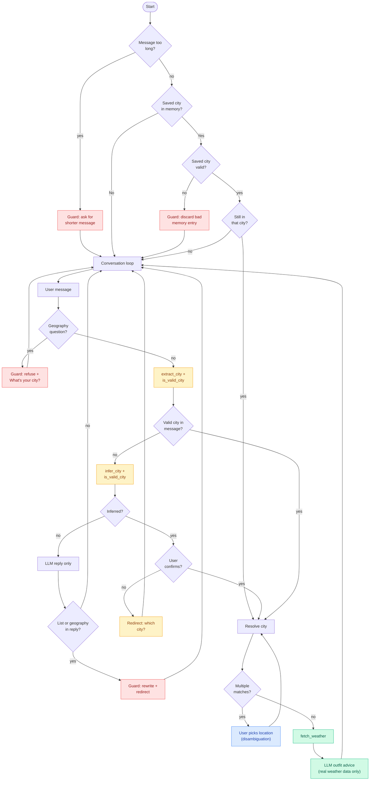

# Weather + Outfit Advisor Agent

A custom AI agent that fetches real-time weather and recommends what to wear. It uses any OpenAI-compatible LLM endpoint (e.g. a self-hosted vLLM gateway).

**Two interfaces, one agent** — run it in the **terminal (CLI)** or in the **browser (web)**. Both use the same `weather_agent.py` logic, the same `.env` config, and the same persistent memory file.

> **Purpose:** A minimal, readable agent you can study and extend. See [Learning Path](#learning-path) for what it teaches and what to build next.

## Demo Video

Watch the agent in action — CLI and web interfaces, weather lookup, and outfit advice:

[Weather & Outfit Advisor demo](https://dai.ly/xany96q)

## Features

Shared by CLI and web:

- **Live weather** via [Open-Meteo](https://open-meteo.com/) — no weather API key required
- **Outfit advice** based on temperature, rain, and wind
- **City disambiguation** — when a name matches multiple places (e.g. Queenstown), you pick the correct one
- **Persistent memory** — remembers your last city across sessions and across both interfaces (`agent_memory.json`)
- **Guardrails** — keep the agent in scope and always give the user a way forward (see [Guardrails](#guardrails))
- **Confirmation flows** — yes/no for remembered cities and inferred locations ("my hometown")
- **Rate-limit handling** — friendly message when weather APIs throttle

Web-only extras:

- **Chat UI** with weather cards, condition styling, outfit icons, and a clickable location picker
- **REST API** for chat, session start/reset, and health checks

## Requirements

- Python 3.9+
- A running LLM server with an OpenAI-compatible API (e.g. vLLM, Ollama, or a cloud gateway)

## Quick Start

One install and one config file powers **both** CLI and web.

1. **Install dependencies**

   ```bash
   pip install -r requirements.txt
   ```

2. **Configure environment**

   ```bash
   cp .env.example .env
   ```

   Edit `.env` and set at minimum:

   ```env
   BASE_URL=http://localhost:8000/v1
   MODEL=qwen3-coder
   API_KEY=not-needed
   ```

3. **Run — pick your interface**

   | Interface | Command | Where to use it |
   |-----------|---------|-----------------|
   | **CLI** | `python weather_agent.py` | Terminal — type messages, get text replies. Exit with `quit` or `exit`. |
   | **Web** | `python app.py` | Browser — open [http://localhost:5000](http://localhost:5000) |

   You can switch between them anytime. If you set a city in the CLI, the web app will offer "Are you still in …?" on the next visit, and vice versa.

## CLI vs Web

| | CLI (`weather_agent.py`) | Web (`app.py`) |
|---|--------------------------|----------------|
| **Best for** | Scripts, SSH, quick terminal use | Visual chat, weather cards, sharing a link on your network |
| **Input** | Type in terminal | Chat box in browser |
| **Disambiguation** | Numbered list — type `1`, `2`, `3`… | Clickable location buttons |
| **Yes / No** | Type `yes` or `no` | Buttons in chat (startup, confirmations) |
| **Weather display** | Plain text from the agent | Styled card with temp, rain, wind, outfit icons |
| **Session memory** | Chat history for current run only (RAM) | Chat history per browser session (server RAM) |
| **Persistent memory** | `agent_memory.json` (shared) | `agent_memory.json` (shared) |
| **Extra config** | LLM vars in `.env` only | LLM vars + optional `FLASK_*` / `SECRET_KEY` |

## Configuration

All settings live in `.env`.

**Required for CLI and web** (LLM connection):

| Variable | Description | Default |
|----------|-------------|---------|
| `BASE_URL` | OpenAI-compatible LLM gateway URL | *required* |
| `MODEL` | Model name served by the gateway | *required* |
| `API_KEY` | API key for the gateway | `not-needed` |
| `INPUT_MAX_LENGTH` | Max user message length | `500` |

**Web only** (Flask — ignored by CLI):

| Variable | Description | Default |
|----------|-------------|---------|
| `SECRET_KEY` | Flask session secret | auto-generated |
| `FLASK_ENV` | `development` or `production` | `development` |
| `FLASK_HOST` | Web bind address | `0.0.0.0` |
| `FLASK_PORT` | Web port | `5000` |

## Web API

Only used when running `python app.py`. The CLI talks to `weather_agent.py` directly and does not use these routes.

| Endpoint | Method | Purpose |
|----------|--------|---------|
| `/` | GET | Chat UI |
| `/api/chat` | POST | Send a message; handles chat, yes/no confirmation, and city disambiguation |
| `/api/start` | POST | Startup flow when a remembered city exists |
| `/api/reset` | POST | Clear session and start fresh |
| `/health` | GET | Health check |

**Example chat request:**

```json
POST /api/chat
{ "message": "Queenstown" }
```

**City disambiguation response** — user clicks a location in the UI, which sends:

```json
{ "message": "Queenstown, Otago, New Zealand", "disambiguation_index": 2 }
```

## Usage Examples

The agent behaves the same in both interfaces; only the presentation differs.

### Ambiguous city

**CLI:**

```
You: Queenstown
Agent: I found multiple places called "Queenstown". Which one did you mean?
  1. Queenstown, Eastern Cape, South Africa
  2. Queenstown, Maryland, United States
  3. Queenstown, Otago, New Zealand
Pick a number: 3
Agent: It's quite chilly in Queenstown with a temperature of 1.2°C...
```

**Web:**

```
You: Queenstown
Agent: I found multiple places called "Queenstown". Which one did you mean?
       [1. Queenstown, Eastern Cape, South Africa]
       [2. Queenstown, Maryland, United States]
       [3. Queenstown, Otago, New Zealand]
You: (click 3)
Agent: (weather card — ~1°C, cold theme, outfit advice for Queenstown, NZ)
```

### Remembered city (shared memory)

Use either interface first; the other will pick up the saved city on the next run via `agent_memory.json`:

```
CLI:  Agent: Are you still in Queenstown, Otago, New Zealand? (yes/no):
Web:  "Are you still in Queenstown, Otago, New Zealand?"  [Yes] [No]
```

### Off-topic guardrail (both interfaces)

```
You: What country is Pindi in?
Agent: I'm just your outfit advisor, so I can't help with geography questions —
       but I'd love to help you figure out what to wear! What's your city?
```

## Guardrails

Guardrails keep the agent **in scope** (weather + outfits only) and **never lock the user out** — every block or correction ends with a redirect back to a useful next step (e.g. "What's your city?", "Which one did you mean?", "Could you name a specific city?").

The project uses **two layers**:

| Layer | What it is | Limitation |
|-------|------------|------------|
| **Prompt rules** | Instructions in `SYSTEM_PROMPT` (refuse off-topic, never invent weather numbers, don't list cities) | Soft — the model can ignore them |
| **Code guardrails** | Python checks before/after the LLM runs | Hard — cannot be talked around |

### Input guardrails (before the LLM acts)

| Guardrail | Function | What it prevents | User is never stuck because… |
|-----------|----------|------------------|------------------------------|
| **Message length** | `INPUT_MAX_LENGTH` (500 chars) | Runaway / abuse prompts | Agent asks for a shorter message |
| **Geography questions** | `is_geography_question()` | "What country is X in?", "Where is Y?" | Polite refusal + "What's your city?" |
| **City validation** | `is_valid_city()` on `extract_city` / `infer_city` | Math answers, digits, garbage treated as cities | Treated as no city — agent asks or chats normally |
| **Inferred-city confirm** | yes/no before acting on a guess | Silently assuming "my hometown" means the wrong place | User can say no → "Which city would you like?" |
| **Remembered-city confirm** | yes/no on startup | Stale `agent_memory.json` used without consent | User can say no → "Where are you today?" |
| **City disambiguation** | `resolve_city()` when multiple geocode hits | Wrong Queenstown / wrong weather | User picks from a list — conversation continues |
| **Memory self-heal** | `is_valid_city()` on read of saved city | Corrupt old entries in `agent_memory.json` | Bad entry discarded; agent asks for city fresh |

### Output guardrails (after the LLM replies)

| Guardrail | Function | What it prevents | User is never stuck because… |
|-----------|----------|------------------|------------------------------|
| **List detector** | `is_list_reply()` | Model dumping a directory of cities | Reply replaced with "tell me the specific city you're in" |
| **Geography leak** | `is_geography_reply()` | Model answering "X is in Pakistan" despite prompt | Same off-topic refusal + redirect to outfit help |
| **Anti-hallucination rule** | `SYSTEM_PROMPT` + `[System note: weather data]` injection | Invented temperatures when no tool was called | Model only cites numbers from real API data in context |

### Scope principle

> **Block the bad behavior, not the conversation.**  
> Guardrails refuse or rewrite off-topic output, then always invite the user to continue with weather or outfit help — the chat never dead-ends.

For the design rationale (prompt vs code, real bugs that motivated each guardrail), see [Notes_Understaning_Custom_Agent.md](Notes_Understaning_Custom_Agent.md).

## Project Structure

```
weather_agent-vllm/
├── weather_agent.py              # Core agent: LLM, tools, memory, guardrails, CLI
├── app.py                        # Flask web server and REST API
├── config.py                     # Environment-based configuration
├── templates/
│   └── index.html                # Web chat UI
├── requirements.txt              # Python dependencies
├── .env.example                  # Environment template
├── agent_memory.json             # Created at runtime (last city)
└── Notes_Understaning_Custom_Agent.md   # Design deep-dive
```

## Architecture

**Two entry points, one brain**

```
                    ┌─────────────────────┐
                    │   weather_agent.py   │
                    │  (agent logic + CLI) │
                    └──────────┬──────────┘
                               │
              ┌────────────────┴────────────────┐
              │                                 │
     python weather_agent.py            python app.py
         (terminal)                    (Flask + browser)
              │                                 │
              └────────────────┬────────────────┘
                               │
                    agent_memory.json  ← shared last city
                    .env               ← shared LLM config
```

- `weather_agent.py` — all agent logic (ReAct loop, weather tool, guardrails, memory). Run directly for CLI.
- `app.py` — web presentation layer: sessions, HTTP routes, JSON responses. Imports `weather_agent`; does not duplicate agent logic.

**Agent loop (one turn)**

1. **Input guard** — length check, geography block, city validation
2. **Extract city** — explicit name in message, or infer from context
3. **Confirm** — yes/no if the city was inferred or remembered (never assume silently)
4. **Disambiguate** — if multiple geocode matches, user picks (never auto-pick the wrong place)
5. **Act** — `fetch_weather` via Open-Meteo
6. **Answer** — LLM turns real weather data into outfit advice
7. **Output guard** — list detector + geography leak check; rewrite and redirect if needed

**Memory**

| Type | Storage | What is saved |
|------|---------|---------------|
| Session | In-memory (Flask) or RAM (CLI) | Full chat history for the current run |
| Persistent | `agent_memory.json` | Only `last_city` (full resolved label, e.g. "Queenstown, Otago, New Zealand") |

## Agent Flow Diagram

Guardrails are shown in **red**. Every red path **redirects** the user back into the conversation — the agent stays in scope and the user is never locked out.



**Legend**

| Color | Meaning |
|-------|---------|
| Red | Input/output guardrail — block or rewrite, then redirect |
| Amber | Validation / extraction check (`is_valid_city`, confirm before act) |
| Blue | Disambiguation — user picks, flow continues |
| Green | Tool call + final answer using real weather data |

## Learning Path

This repo is intentionally **small**. It is a working app and a **reference implementation** for building more complex agents later. Read the annotated `weather_agent.py` top-to-bottom — the comments map directly to the concepts below.

### What this project teaches

| Concept | Where to look | Key idea |
|---------|---------------|----------|
| **Brain** | `call_llm()`, `.env` LLM config | A generalist model + a role; provider-agnostic (vLLM, Ollama, cloud APIs) |
| **Rules** | `SYSTEM_PROMPT` | Plain-text instructions that shape behavior — soft enforcement only |
| **Tools** | `fetch_weather()`, `geocode_city()` | The AI never runs code; your program executes tools and returns results |
| **Manual tool-calling** | `extract_city()`, `infer_city()` | When native function-calling isn't available, use focused LLM prompts as "think" steps |
| **ReAct loop** | `run_turn()` | Think → act → observe → answer, one turn at a time |
| **Session memory** | `chat_history` list | Full conversation re-sent each turn; lives in RAM for one run |
| **Persistent memory** | `agent_memory.json`, `load_memory()` | Selective facts on disk (`last_city` only — not a full transcript) |
| **Confirm before acting** | yes/no flows, startup modal | Never silently use inferred or remembered information |
| **Human-in-the-loop** | City disambiguation | When the model can't resolve ambiguity, ask the user — don't guess |
| **Code guardrails** | `is_valid_city()`, `is_geography_*()`, `is_list_reply()` | Hard checks the model cannot bypass; always redirect, never lock out |
| **Separation of concerns** | `weather_agent.py` vs `app.py` | Agent logic is independent of CLI / web presentation |

### What to build next (in order)

Each step extends this project without throwing away what you learned:

1. **Second tool** — e.g. air quality or a 3-day forecast. Add a routing step in `run_turn()`: "which tool does this message need?"
2. **Structured turn results** — replace `str | dict` returns with a small `TurnResult` dataclass (`reply`, `needs_confirmation`, `needs_disambiguation`, `weather`, etc.). Cleaner as pause types multiply.
3. **ReAct loop limits** — max iterations per turn, timeout, repeat detection (same tool + same args twice). Stops runaway loops in multi-step agents.
4. **Output guardrail: number verification** — after the LLM replies, check that any temperature/rain/wind figures match the real `weather` dict from the tool. Catches hallucinations code-side.
5. **Native tool-calling** — switch from manual extraction prompts to OpenAI `tools=` when your gateway supports a matching parser. Compare both approaches in your notes.
6. **Tool registry** — one dict or list describing all tools (name, description, handler). Scales past two tools without spaghetti `if/else`.
7. **Multi-agent** — a planner agent that delegates to specialists (researcher, writer, etc.). Only after single-agent ReAct is solid.

### What to deliberately not add yet

These are common temptations that **hide** the mechanics this project is meant to teach:

| Skip for now | Why |
|--------------|-----|
| **LangChain / LlamaIndex / AutoGen** | Frameworks abstract away the manual ReAct loop you're learning |
| **RAG / vector databases** | Different problem (document retrieval); adds infra before core agent patterns are solid |
| **Many tools at once** | Master one-tool ReAct before routing between several |
| **Multi-agent teams** | Step 7 above — premature complexity without loop limits and guardrails first |
| **Docker / Redis / observability stacks** | Ops concerns; this project runs with `python app.py` and a JSON file |
| **Fine-tuning or custom models** | The brain stays a generalist; specialization comes from rules, tools, and code around it |

When you're ready for theory and the bugs that motivated each guardrail, read [Notes_Understaning_Custom_Agent.md](Notes_Understaning_Custom_Agent.md).
